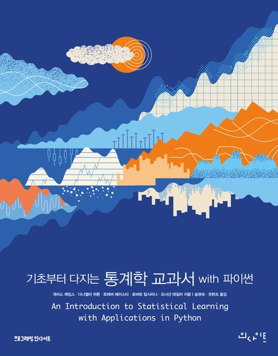

# 기초부터 다지는 통계학 교과서(ISLP_labs)

# [강의 교안 신청 링크](https://docs.google.com/forms/d/e/1FAIpQLSfvYt7AB3QjWoOcNzZs-d-Vqv1YfjQ2ya2AJ34r5S3DruZvPQ/viewform)

    
# 목차

- 2장 통계적 학습 : 
  

- 3장 선형회귀 : 
  

- 4장 분류 : 
  

- 5장 재표집법 : 
  

- 6장 선형모형선택과 규제 : 
  

- 7장 선형을 넘어서 : 
  

- 8장 나무-기반의 방법 : 
  

- 9장 서포트 벡터 머신 : 
  

- 10장 딥러닝 : 
  

- 11장 생존분석과 중도절단자료 : 
  

- 12장 비지도학습 : 
   

- 13장 다중검정 : 

---------------------------------------------

판매처 : https://product.kyobobook.co.kr/detail/S000214961072

# 인용               
@book{song2024intro,           
  author    = {송영숙 and 유현조},            
  title     = {기초부터 다지는 통계학 교과서 with 파이썬},     
  publisher = {인사이트 출판사},    
  year      = {2024},    
  note      = {번역},      
  origtitle = {An Introduction to Statistical Learning},    
  origauthor = {Gareth James, Daniela Witten, Trevor Hastie, Rob Tibshirani, Jonathan Taylor},    
  origpublisher = {Springer},    
  origyear  = {2023}    
}    

